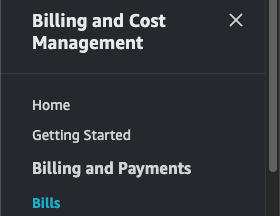
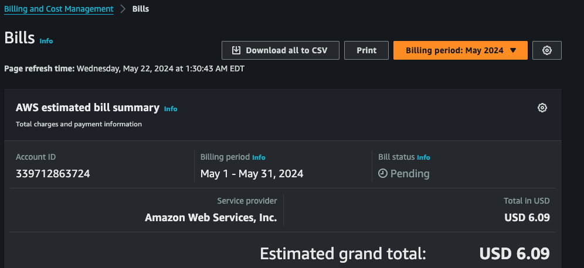
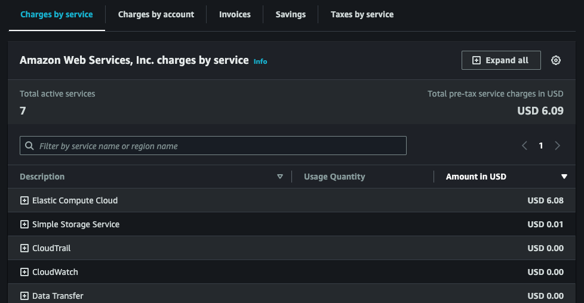
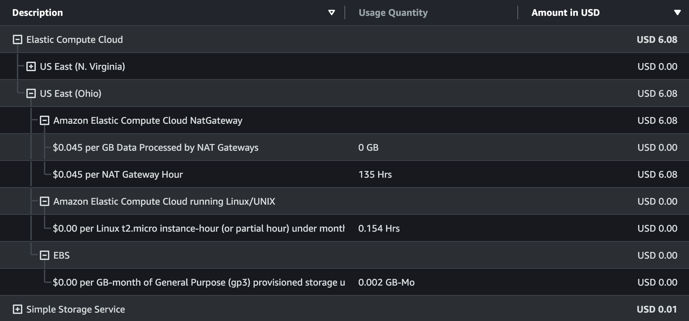

# Billing and Cost Management

This extremely handy service allows the account user to explore the many costs from the many services being used in this AWS account. It should be actively used to vet charges, as many of these services rely on other services, creating a long chain of possible charges that the user was not expecting. This includes services that you might think are completely covered by the Free Tier!

## Explore costs associated with AWS account
Open the AWS Management Console. 
Sign in with your AWS account credentials. 
In the AWS Management Console, search for `Billing and Cost Management` in the search bar and select it from the results. 
From the sidebar, click on `Bills`.

### Bills Page
Here you can view the total amount of cost incurred for this month’s billing cycle.

1. Scroll down to the `Charges by service` tab. This will show exactly how much each AWS service will cost you so far, sorted by highest to lowest by default.

2. Look for any unusual activity in this section.

3. Click the plus icon `+` on the service that costs an unexpected amount. This will continue cascading down through regions and linked services, with the cost at the far right `Amount in USD` column.

4. Eventually you’ll get down to the actual culprit of your unexpected charges. 

In my case, I have determined that an unused NAT Gateway was not properly removed, therefore racking up charges. This could have been a more expensive lesson!