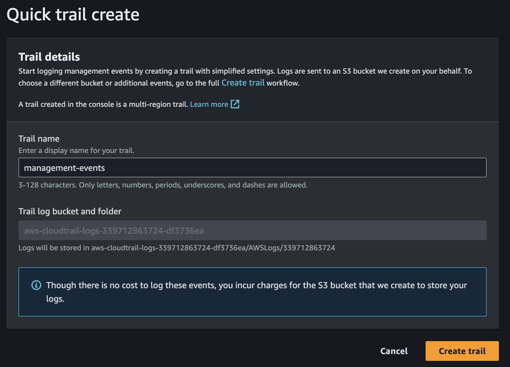
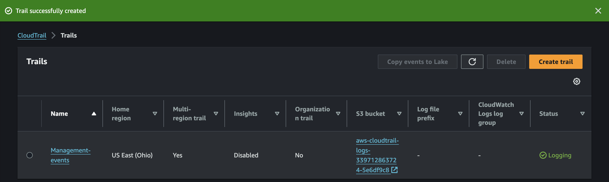

# CloudTrail

## Create Trail
Open the AWS Management Console. 
Sign in with your AWS account credentials. 
In the AWS Management Console, search for `CloudTrail` in the search bar and select it from the results. 
Use `Quick Create` for a New Trail. 
In the **CloudTrail dashboard**, click on `Trails` from the left-hand navigation pane.
Click on the `Create trail` button.

### Configure Quick Create
Select `Quick create`. This option allows you to quickly set up a trail with the recommended settings.

Fill in the required details: 
**Trail name**: Enter a name for your trail.
**Storage location**: Choose a new S3 bucket or an existing one where the trail logs will be stored.
**Log file SSE-KMS encryption (optional)**: If you want to encrypt your log files, you can select an AWS KMS key.

### Specify IAM Events for Monitoring
1. In the **Event type** section, ensure that `Management events` are checked. This is crucial for monitoring IAM events.
2. For **Read/Write events**: 
Select **All** to monitor both read and write events. 
Alternatively, choose **Read-only** or **Write-only** based on your needs.
3. Under **Advanced** settings, make sure to enable `Include AWS API call events` to ensure IAM actions are logged.

### Review and Create
1. Review all the configurations you’ve set up. 
2. Click on the `Create trail` button.

### Verify Trail Creation
1. Once the trail is created, navigate back to the **Trails** section to confirm that your new trail is listed and active.
2. You can now view the logs in the specified S3 bucket and monitor IAM events.

