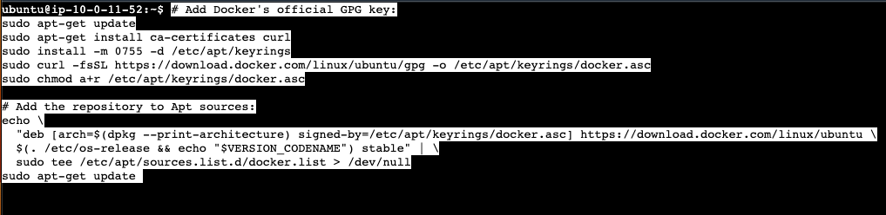
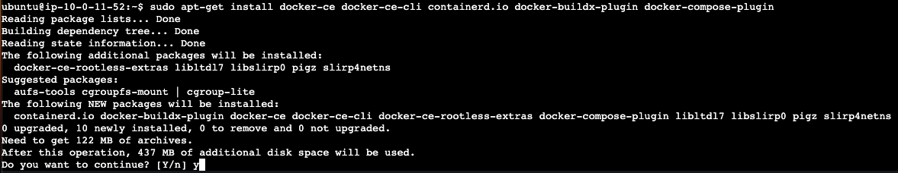
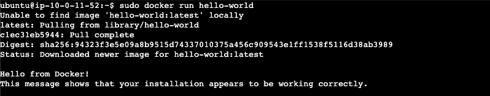

# Docker
This guide will walk you through how to install Docker on the widely supported Ubuntu OS. This will spare you on potential issues during installation and time spent on troubleshooting dependency conflicts from other potentially unsupported systems.


## Update Ubuntu
With the following commands:<br>
`sudo apt update`<br>
`sudo apt upgrade`


## Uninstall Packages
This installation will also install some dependencies as one bundle: `containerd.io`.<br>
Because of this, already having these dependencies installed will conflict with a fresh install.<br>
Remove them with:<br>
`for pkg in docker.io docker-doc docker-compose docker-compose-v2 podman-docker containerd runc; do sudo apt-get remove $pkg; done`

Note: the output might report that 0 dependencies were removed, because you might not have them. But it's still good to run the command to be sure.


# Docker Engine

## Install Docker repository
First, you'll need to set up Docker's repistory by copy/pasting the following block of commands:

```
# Add Docker's official GPG key:
sudo apt-get update
sudo apt-get install ca-certificates curl
sudo install -m 0755 -d /etc/apt/keyrings
sudo curl -fsSL https://download.docker.com/linux/ubuntu/gpg -o /etc/apt/keyrings/docker.asc
sudo chmod a+r /etc/apt/keyrings/docker.asc

# Add the repository to Apt sources:
echo \
  "deb [arch=$(dpkg --print-architecture) signed-by=/etc/apt/keyrings/docker.asc] https://download.docker.com/linux/ubuntu \
  $(. /etc/os-release && echo "$VERSION_CODENAME") stable" | \
  sudo tee /etc/apt/sources.list.d/docker.list > /dev/null
sudo apt-get update
```



These commands will: 
1. update the local package list with information about new packages 
2. install `curl` as well as the `ca-certificates` bundle of trusted Certificate Authorities
3. install create the directory `/etc/apt/keyrings` if it doesn't exist, and set permissions
4. use `curl` to download the GPG key file from `https://download.docker.com/linux/ubuntu` into the file in `/etc/apt/keyrings/docker.asc`
5. set the `/etc/apt/keyrings/docker.asc` GPG key file permissions

6. in short, this long command creates a file that tells `apt` package manager where to find the latest Docker software for your specific version of Ubuntu, and use a special GPG key to verify that the downloaded Docker software is genuine and untampered.


## Install Docker packages
Install with the following command:<br>
`sudo apt-get install docker-ce docker-ce-cli containerd.io docker-buildx-plugin docker-compose-plugin`

Confirm the install at the following prompt with:<br>
`y`




## Start Docker
Start with the following command:<br>
`sudo systemctl start docker`

Verify proper Docker installation by accessing an image on Docker Hub:<br>
`sudo docker run hello-world`




# Docker Compose
This makes managing your applications that implement Docker a little easier. 
You can just create one generic YAML file that will grab the specific containers and services that you need, and spin them up correctly so that they can communicate with each other.
You will be spinning up a few different containers, and those containers are taking advantage of services from other containers.

For example, the front-end and back-end will be taking advantage of an OpenSearch container that will be running the OpenSearch service within it. So it needs to be able to not only install OpenSearch and get that up and running, but it also needs to communicate with it.


## Install Docker Compose plugin
The Docker repository has already been set up.<br>
So update the package index, and install Docker Compose with:
```
sudo apt-get update
sudo apt-get install docker-compose-plugin
```

Verify installation with:<br>
`docker compose version`


