# EBS

Amazon EBS (Elastic Block Store) is a scalable, high-performance block-storage service designed for Amazon EC2.

* It can be used to create storage volumes and attach them to EC2 instances. 
* All EBS volume types offer durable snapshot capabilities and are designed for 99.999% availability.

EBS' elastic volumes feature allows you to increase volume size while the volume is still in use, making the resizing process easier and faster. It also provides the option to completely change the volume type and adjust its performance - also without downtime.

# Show EBS Volume
In an Amazon-Linux system, you can read some information on the EBS volume with the following command: 
`sudo gdisk -l /dev/xvda`

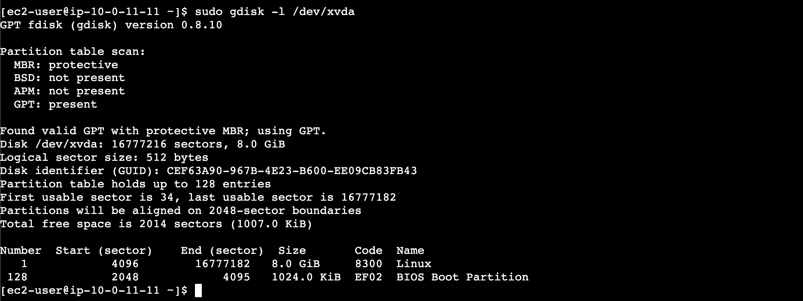

In Linux systems, you can use the following command to display disk usage on the file system: 
`df -h`

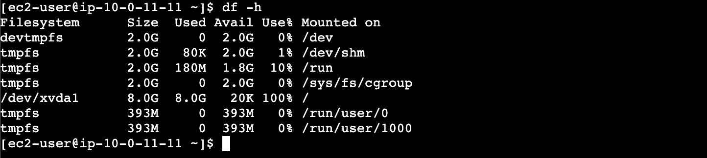

# Create volume snapshot
It's recommended that you create a snapshot back-up before modifying the volume, in case you need to roll back changes.

From the EC2 left-hand pane: 
Snapshots  ->  Create snapshot

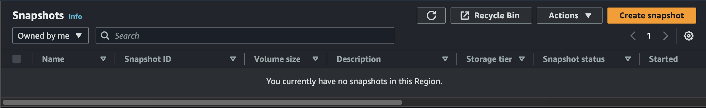

Resource type:  `Volume` 
Volume ID:  `<id-of-EC2-volume>` 
Description:  `ex: Wazuh-Manager Snapshot`

Click `Create snapshot`.

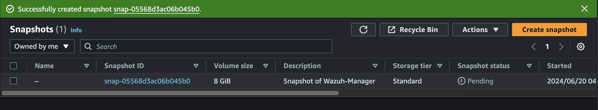

It will take some minutes for the volume to be created.  
You can check progress in the `Snapshot status` column.

# Resize EBS volume with Elastic Volumes

## Modify volume
From the EC2 left-hand pane, click on `Volumes`. 
Check the box for the volume you'd like to modify.

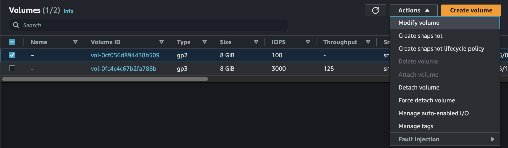

Select any changes you'd like to apply to the EBS volume.

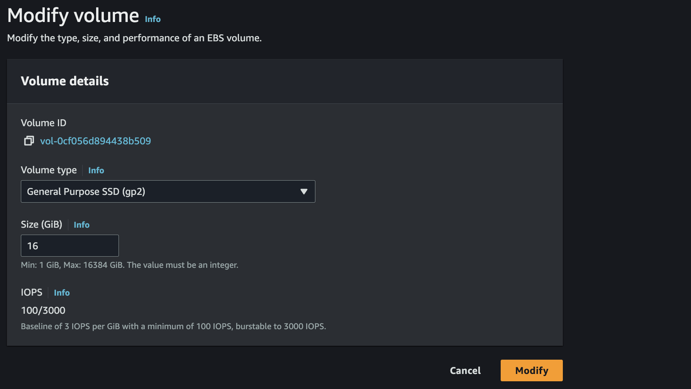

Click on `Modify`, then click on `Modify` again to confirm.

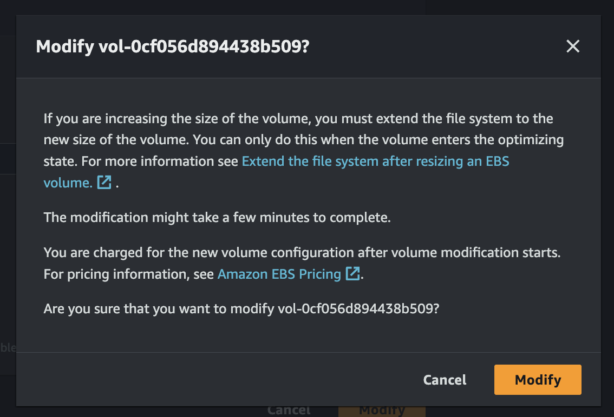

## Extend file system
In order to finish increasing the size of the volume, you'll need to extend the file system after modifying the volume. The volume will first need to enter the optimizing state. In the EC2 volume's page, the `Volume state` should read `In-use` before proceeding.

Connect to your instance, and use the following command: 
`sudo lsblk`

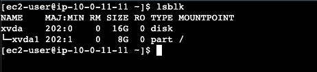

If you look in the output's `TYPE` column, you'll see the size of the full `disk`, and the size of the `part`ition. The partition has the old size before you modified the volume for more space. So now you'll extend the partition to allow access to the full disk space that you're paying AWS for! 
`sudo growpart /dev/xvda 1`

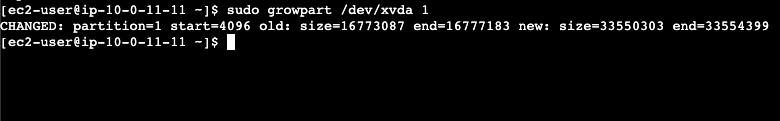

Check that the partition was extended: 
`lsblk`

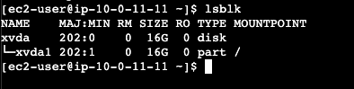

View the file system data with this Linux command: 
`df -hT`

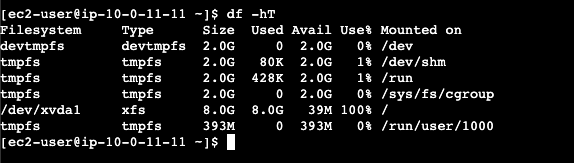

The output should display the `Filesystem`, `Type`, `Size`, `Used`, `Avail`, `Use%`, `Mounted on`. 
The most relevant of these is the Filesystem, Type, and Mount point. In this example, the `xvda1` filesystem's Type is `xfs`, which allows me to use the `xfs_growfs` command on the `/` Mount point.

Use the `xfs_growfs` command to specify the mount point of your desired filesystem, aka `xvda1`: 
`sudo xfs_growfs -d /`

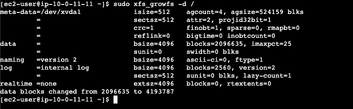

For an `ext4` filesystem, use the `resize2fs` command instead. For example, if the filesystem is named `/dev/nvme0n1p1`, you can use this command: 
`sudo resize2fs /dev/nvme0n1p1`

Check that the size of the filesystem has been extended: 
`df -hT`

As you can see, the previous 8gb size is now 16gb.

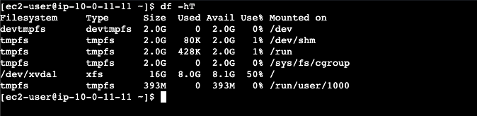

Congrats! You've just increased the amount of hard disk availability!