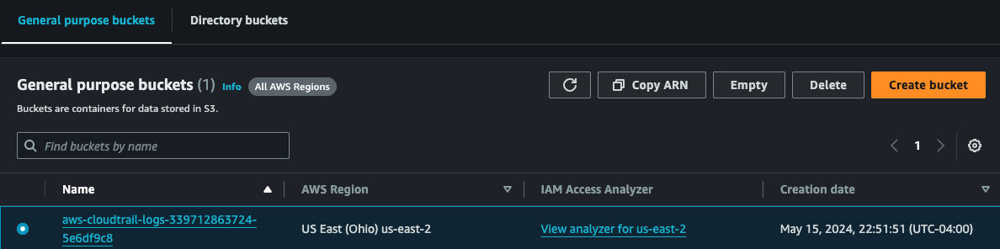
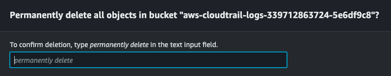
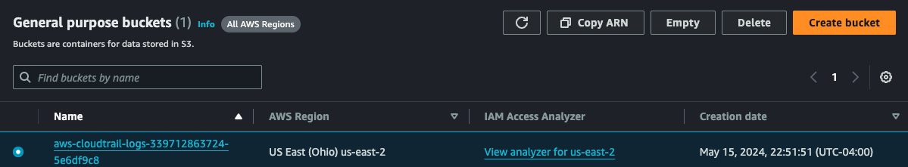
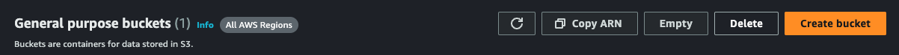

# S3

## Create Bucket
Open the AWS Management Console. 
Sign in with your AWS account credentials. 
In the AWS Management Console, search for `S3` in the search bar and select it from the results. 

## Empty Bucket
1. From the **Buckets** page, check the bucket that you'd like to empty of all objects (data).

2. Click the `Empty` button.
3. Confirm deletion of objects by typing in the required message at the bottom of the page.

4. Click on the `Exit` button at the top of the page.

## Delete bucket
After the bucket has been emptied, you can delete it.
1. Navigate to the `Buckets` page.
2. Check the bucket.

3. Click the `Delete` button.

4. Confirm the deletion by typing in the message they ask for.
5. Click `Delete`.

Congrats, you've just deleted the bucket.
