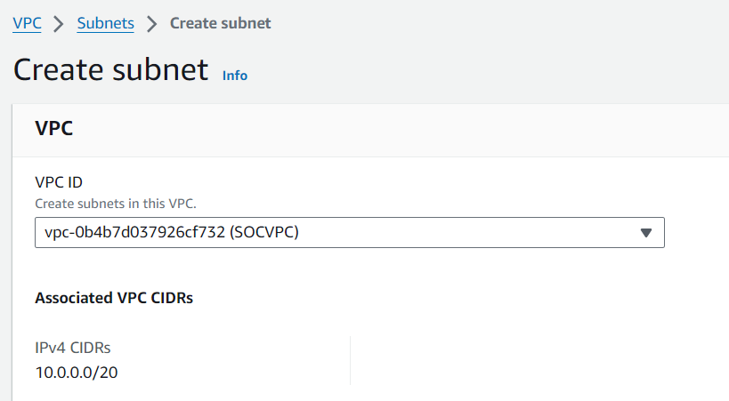
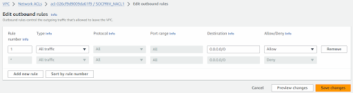

# VPC

Configuring a Virtual Private Cloud (VPC) on AWS for a secure SOC environment involves several steps to ensure proper network segmentation, access control, and data protection. 

## Create the VPC
Navigate to the VPC dashboard in the AWS Management Console.
Click on `Create VPC`.
Enter a name for your VPC, e.g., "SOC-VPC."

IPv4 CIDR block: Define the CIDR block for your VPC, e.g., "10.0.0.0/20."
Click on "Create VPC."

## Create the Public subnet (DMZ)
Within your newly created VPC, navigate to "Subnets."
Click on "Create subnet."

Name tag: Enter a name for your subnet, e.g., "SOC_DMZSubnet."
Choose an AZ for your subnet.
IPv4 CIDR block: Define the CIDR block for your subnet, e.g., "10.0.10.135/24."
Click on "Create subnet."

## Create Private Subnets
We will create a private subnet for this SOC environment. This subnet will host our SOC tools such as wireshark, PfSense, and Wazuh.

Navigate to the VPC dashboard in the AWS Management Console.
Click on "Subnets” then “Create subnet."

Enter a name for your subnet, e.g., "SOC_PRIVSUB1."
Choose an AZ for your subnet.
IPv4 CIDR block: Define the CIDR block for your subnet, e.g., "10.0.14.0/24"

Note: Do not associate a route table with an internet gateway to keep these subnets private.

## Configure Route Tables (DMZ) and Internet Gateway
A route table contains a set of rules, called routes, that determine where network traffic from your subnet or gateway is directed. In this environment, we will have a route table for the DMZ, and a route table for our private subnets.

Navigate to the Route Tables section in the VPC dashboard and create a route table or associate an existing route table within the SOC VPC to the DMZ.

To associate an existing route table, navigate to subnet associations and click “edit associations”.

Click on the subnet that you want to attach to the route table and click “save associations”.

Navigate to routes and click “Edit routes”. Edit the route table for the DMZ subnet and add a route for internet traffic (0.0.0.0/0) pointing to an internet gateway (IGW).

### Create Internet Gateway
An internet gateway (IGW) is a VPC component that allows communication between your VPC and the internet. An IGW enables resources in your public subnets (such as EC2 instances) to connect to the internet if the resource has a public IPv4 address or an IPv6 address. Similarly, resources on the internet can initiate a connection to resources in your subnet using the public IPv4 address or IPv6 address. For example, an internet gateway enables you to connect to an EC2 instance in AWS using your local computer.

In order to attach the route to an Internet gateway, an internet gateway must be created.
Navigate to your VPC dashboard and select the Internet gateway.
Name the Internet gateway e.g., “SOC_DMZ-igw”
Click “Create internet gateway”.

### Connect Internet Gateway
Now we have to attach the Internet gateway to our SOC-VPC
Select the newly created IGW and click “Actions”. 
Select “Attach to VPC” from the dropdown menu and attach your IGW to the SOC VPC, then save.

Navigate back to Route Tables and you will now be able to add a route for internet traffic (0.0.0.0/0) pointing to your newly created internet gateway (IGW) that’s attached to your VPC.

## Configure Route Tables CONTINUED…   SOCPRIVSUB
The route table for a private subnet usually does not have a route to the internet. Instead, it may have routes to internal resources, other VPCs (via VPC peering or VPN), or services like AWS Direct Connect. Instances in the private subnet can communicate with each other and with resources in the same VPC, but they cannot directly access the internet.

This separation of routing ensures that resources in private subnets remain isolated from direct internet access, providing an additional layer of security. If you need instances in a private subnet to access the internet for tasks like software updates, you can set up a NAT gateway or NAT instance in the public subnet and route the traffic from the private subnet through it. This allows outgoing internet traffic while still keeping inbound traffic blocked.

Every route table in a VPC automatically includes a local route for communication within the VPC. You don't need to add this manually.

Outbound Traffic:
For outbound internet access, if your private subnet requires it, you typically route traffic to a NAT Gateway or NAT Instance/Bastion Host.

If using a NAT Gateway:
Add a route with the destination 0.0.0.0/0 and the target set to the NAT Gateway.

If using a NAT Instance:
Add a route with the destination 0.0.0.0/0 and the target set to the NAT Instance.

(NOTE: In order to create and attach the outbound traffic route we need to create a NAT Gateway/NAT Instance) See "7. Create a NAT Gateway page 32" for guide on creating a NAT Gateway.

Add Route:
Click on the "Routes" tab of the selected route table.
Click "Edit routes" to begin adding or editing routes.
Add Routes to NAT Gateway:

Once you've added or modified routes as needed, save the changes to the route table. In the Route Table's details, click on the "Subnet associations" tab, then click "Edit subnet associations" and select the private subnet (SOC_PRIVSUB1).

5. NACL Setup for DMZ 
First we will create a NACL for our DMZ subnet. This subnet will host our Web App, Bastion Host, and Metasploitable. We need to configure our inbound and outbound rules for our instances to function properly.

Navigate to the VPC Dashboard. 
Select "Network ACLs" under the "Security" section
Click “Create network ACL”
Provide a name for your first NACL (e.g., SOCDMZ_NACL) and select the VPC where your DMZ subnet resides.

Now we can attach our NACL to our DMZ Subnet.
Click on the newly created NACL (e.g., SOCDMZ_NACL1).
Go to the "Subnet associations" tab.
Click "Edit subnet associations".
Select the checkbox for the subnet you want to associate with this NACL (e.g., SOC_DMZSubnet) and click "Save".

Now let’s configure the Inbound Rules for our SOCDMZ_NACL
Select the SOCDMZ_NACL from the list.
Select “Edit Inbound Rules” and “Add new rule”

Add rules to allow traffic necessary for the bastion host and other public services.
Rule 1: HTTP (80)
Rule 2: HTTPS (443)
Rule 3: ICMP (All)
Rule 4: SSH (22)

Click "Save changes"

Now let’s configure the Outbound Rules for our SOCDMZ_NACL.
Click on "Edit outbound rules" and “Add new rule”.

Add rules to allow necessary outbound traffic. This is common for DMZ subnets but adjust according to your security needs.
Click on "Save".

6. NACL Setup for Private Subnet (SOCPRIV_NACL1)
Navigate to the VPC Dashboard. 
Select "Network ACLs" under the "Security" section
Click “Create network ACL”
Provide a name for your NACL (e.g., SOC_PRIVNACL1) and select the VPC where your private subnets reside.

Now we can attach our NACL to our first Private Subnet.
Click on the newly created NACL (e.g., SOCPRIV_NACL1).
Go to the "Subnet associations" tab.
Click "Edit subnet associations".
Select the checkbox for the private subnet you want to associate with this NACL (e.g., SOC_PRIVSUB1) and click "Save".

In our Private subnet (SOC_PRIVSUB1) we are going to host Wazuh and PfSense firewall.
Wazuh’s platform includes security capabilities for cloud, container, and server applications. Log data analysis, intrusion and malware detection, file integrity monitoring, configuration assessment, vulnerability detection, and regulatory compliance help are examples of these services. The three components that make up the Wazuh solution are as follows:

We need to configure the NACL inbound and outbound rules for Wazuh on this subnet to function properly.

### Inbound Private NACL Rules (SOCPRIV_NACL1)
In the Network ACLs tab, Navigate to Inbound rules and select “Edit inbound rules” and click “Add new rule”.

Inbound Rule 1: Allow Wazuh Agent Communication (Port 1514 and 1515)
Inbound Rule 2 & 3: Allow HTTP/HTTPS (Ports 80 and 443) for Web Access
Inbound Rule 4: Allow ICMP for Network Diagnostics
Inbound Rule 5: Allow SSH (Port 22) for Administrative Access
*Save all changes*

### Outbound Private NACL Rules (SOCPRIV_NACL1)
Outbound Rule 1: Allow All Outbound Traffic

7. Create a NAT Gateway
Allocate an Elastic IP Address:
Navigate to "Elastic IPs".
Click "Allocate Elastic IP address".
Click "Allocate".

### Create the NAT Gateway:
Navigate to "NAT Gateways" and Click "Create NAT Gateway".
Subnet: Select your Public-Subnet.
Elastic IP Allocation ID: Select the Elastic IP you just allocated.
Click "Create".

### Update the Private Route Table:
Navigate back to "Route Tables".
Select your Private-Route-Table (Rt_SOCPRIVSUB1).
Go to the "Routes" tab.
Click "Edit routes" -> "Add route".
Destination: 0.0.0.0/0 _______
Target: Select your NAT Gateway.
Click "Save routes".

### Security Group for Wazuh_Manager
Navigate to the EC2 Dashboard.
In the navigation pane, select “Security Groups”.
Click on “Create security group.

You need to configure the appropriate inbound rules to allow traffic for Wazuh services:

Click `Create security group`.

