# Wazuh manager installation with Amazon Linux using RDP

## Create Amazon Linux EC2 instance
**Name:**  _WAZUH-manager_
**Key pair name:**  _WAZUH-manager-KEY-PAIR_

Search for MATE in the AMI search bar. 
Choose the free tier elegible “Amazon Linux 2 with .NET 6, PowerShell, Mono, and MATE Desktop Environment” AMI. 

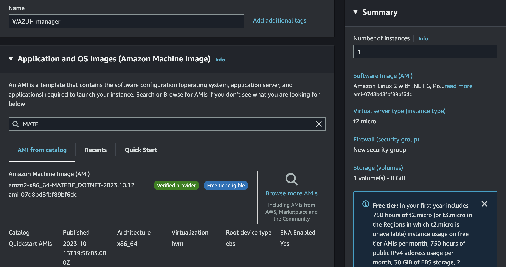

Give it the same options as the [METASPLOIT](METASPLOIT.md) instance.

However, you’ll want to create a  _WAZUH-manager-security-group_. 
It will only accept SSH and RDP traffic. 
Next to **Network settings**, click `Edit`.

We will also plan on connecting via RDP (Remote Desktop Protocol). 
So add a new rule: 
**Type:**  _RDP_ 
**Source:**  _My IP_

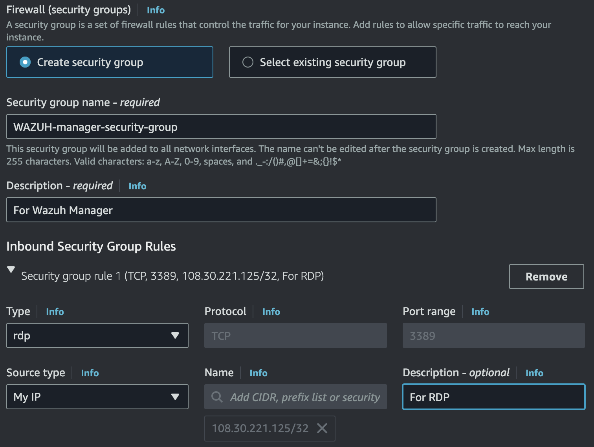

Keep the default SSH rule with the source listed as  `0.0.0.0/0`  which means from  `Anywhere`, and it is still considered quite safe. This is because the connection requires the  _.pem_  security key pair, which is encrypted with the RSA algorithm.

Launch the instance. 
You’ll be directed to the EC2 Instances page.

### Configure Security Group rules
The  **Security Group**  acts as the virtual firewall at the EC2 instance level. 
You'll need to allow traffic to and from your Wazuh agent. 
At the bottom of the EC2 instances window, click on the  **Security**  tab. 
`WAZUH-security-group`  ->  `Inbound rules`  ->  `Edit inbound rules`

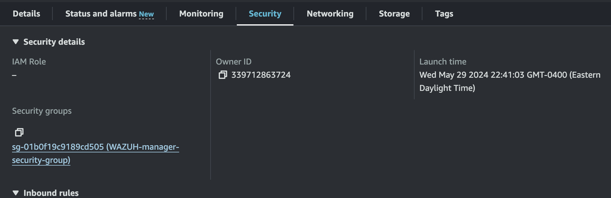

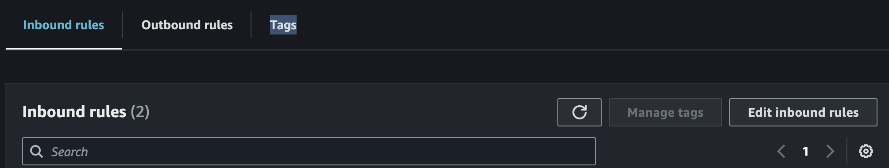

Add two rules: 
Port range:  1514  |  Source: <Wazuh_agent_IP>  |  Description: For Wazuh agent 
Port range:  1515  |  Source: <Wazuh_agent_IP>  |  Description: For Wazuh agent

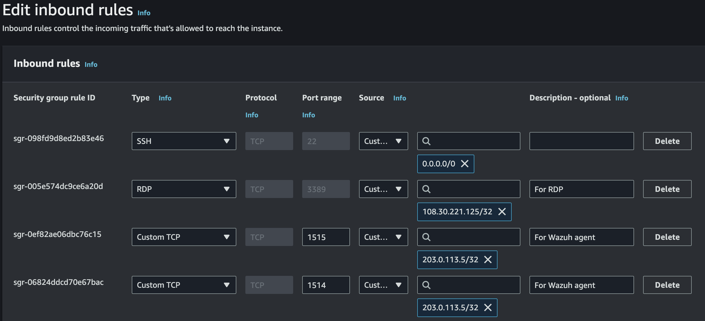

Click on `Save rules`.

### Connect to Amazon Linux 2 AMI instance
You already know how to connect via SSH. So let’s try a new connection. 
After the instance is up and running, click the  `Connect` button.
You'll be at the `EC2 Instance Connect` tab.

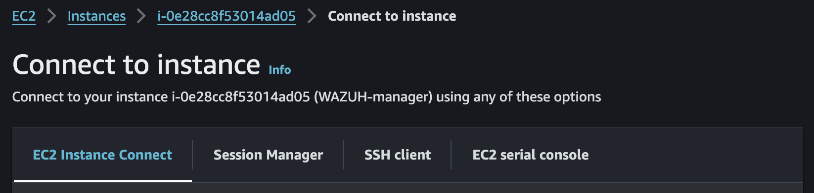

Change the username from  `root`  to  `ec2-user`. This is the default user for any EC2 instance. Additionally, it’s the only user that the Amazon Linux AMI accepts. 
Click on  `Connect`.

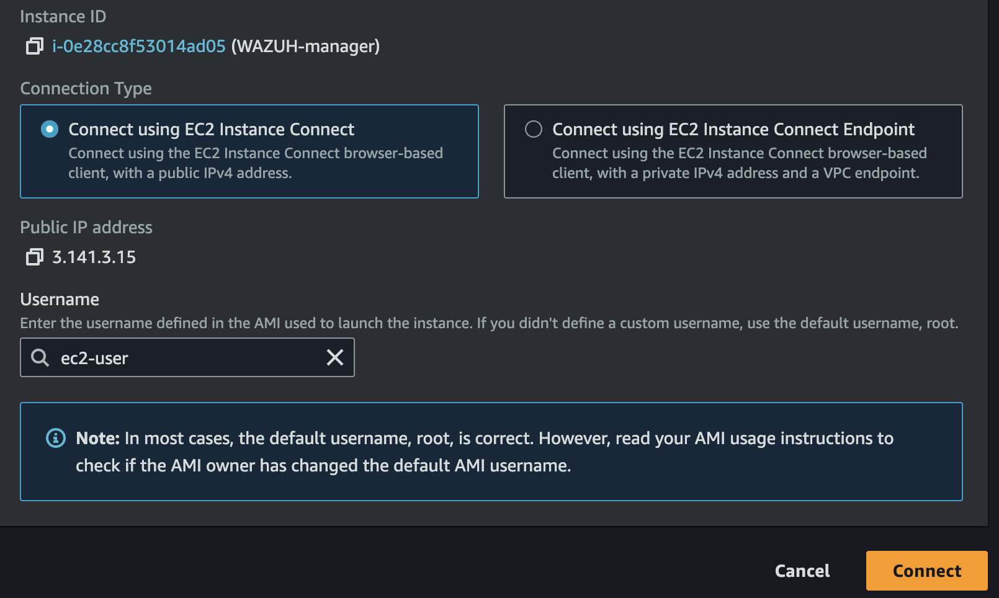

A new browser window will launch, and you’ll conveniently be securely connected to your Linux instance. 

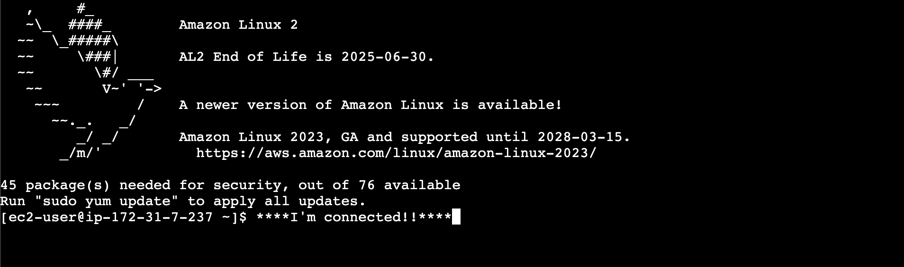

This tool is built into EC2 instances, and can be accessed from the AWS console. 
How easy was that?!

Now let’s update the packages. 
Instead of using  `apt-get`  like you might be used to, this Amazon Linux distribution uses the  `yum`  package manager. YUM (Yellow Dog Updater, Modified) is an open-source Linux package management application that uses the RPM package manager. It allows you to search official and third-party repositories and install, update, or remove packages from the system. 
`$  sudo yum update -y`

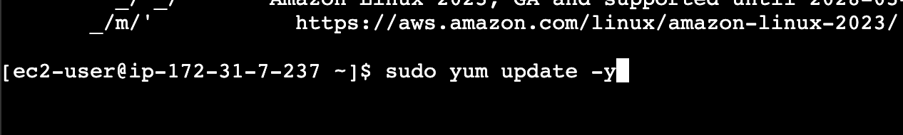

After the updates have finished downloading and installing, update the password for the current user  `ec2-user`  that you switched to earlier. 
`$  sudo passwd ec2-user`

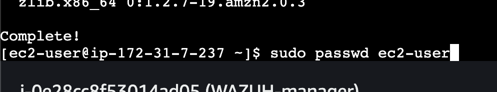

Type in your new password. Then confirm the new password. 
Try to use a secure password, since you might end up opening ports on the instance later on down the line and opening the attack surface. 
If you forget it, you can log back in as root and change the password. 
The password that you’ll absolutely always want to remember is the root user’s password. If you forget this password, you will not be able to change it. 
AWS configures the EC2 instances to not be able to change the password on the root account. Enabling the root password is a process with many steps. Stay tuned for a guide that I’ll be writing on it.

Now download the Microsoft Remote Desktop Protocol application. Amazon Linux 2 supports using Microsoft RDP to connect to your instance from your host. 
You can find the link at this url for the Apple Store: 
`https://apps.apple.com/us/app/microsoft-remote-desktop`

After it’s downloaded and installed, open the application. 
Click  `Add PC`.

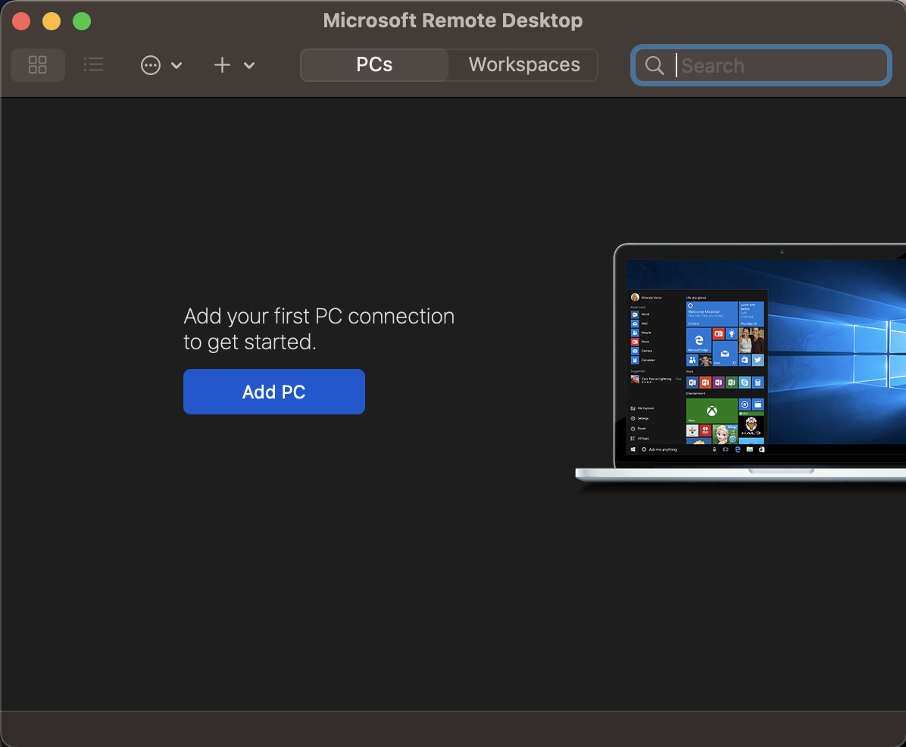

Click `User account` -> `Add User Account`

Copy the credentials from your WAZUH instance into the application: 
**PC name:**  `203.0.113.5` 
**User Name:**  `ec2-user` 
**Password:**  _<passwd you previously entered>_ 
**Friendly Name:**  `Wazuh User`

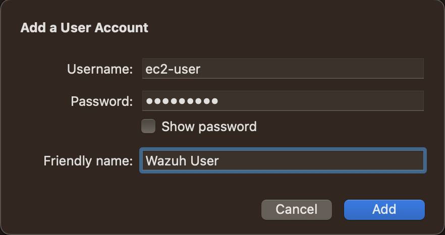

Click `Add` 
You’ll see the new connection in the window. 
Double click. 
`Continue` with the connection, since it’s our trusted instance.

If you do not have access, you might need to reboot your instance.

You should now see the MATE GUI for your WAZUH instance! Congrats!

## Install Wazuh Manager
This method uses the Wazuh installation assistant. Note that the Wazuh Indexer is not compatible for installation on an m1 chip, making the long manual installation of the Wazuh Server and Wazuh Dashboard pointless. Wazuh should not be installed on a Mac silicon chip, as it does not fully support the ARM architecture.

First, let’s scale our EC2 instance to  _t2.medium_. The current instance type for the EC2 instance isn’t supported by the automatic wizard installation. 
Our current free tier  _t2.micro_  instance type only has 1 core and 1 GB of RAM. 
The minimum requirements are 2 core CPU, and 4GB of RAM. 

### Vertically scale EC2 instance
1. Stop instance
2. Refresh page
3. Actions  ->  Instance Settings  ->  Change instance type

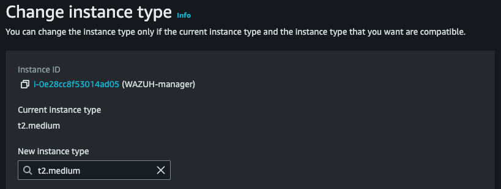

**New instance type:**  _t2.medium_ 
**Memory:**  _4GB_ 
**vCPUs:**  _2_

Click `Apply` to accept.  
Start the instance.

### Install Wazuh using automatic installation assistant
Download Wazuh installation assistant, and install Wazuh server: 
`$  curl -sO https://packages.wazuh.com/4.7/wazuh-install.sh && sudo bash ./wazuh-install.sh -a`

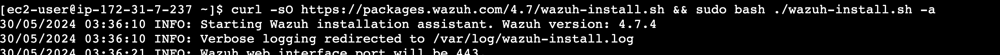

This command executes the following tasks: 
`$  curl -sO https://packages.wazuh.com/4.7/wazuh-install.sh`
* This command is using  **cURL**  which uses the  `https://packages.wazuh.com/4.7/`  url to download the  `wazuh-installation.sh`  script.
* `-s`  flag operates cURL in silent mode. It won’t clutter the terminal screen by show progress or error messages.
* `-O`  flag tells cURL to save the downloaded file with the same name as the remote file.

The second part of the command is connected by the  `&&`  logical operator to execute the second command if the first command executes successfully: 
`$  sudo bash ./wazuh-install.sh -a` 
* `sudo bash ./wazuh-install.sh`  uses  `bash`  to execute the downloaded shell script  `./wazuh-install.sh` with sudo privileges.

This will install the following items: 
* **Wazuh Indexer**
* **Wazuh server**
* **Filebeat**
* **Wazuh Dashboard**

It will also initialize the Wazuh Dashboard web application.

Wazuh is installed and configured. This saves us the time involved to do it manually. 
At some point in the future, I might include the documentation for the manual installation.

The installation process has automatically created a few files in your system. 
Among them is the passwords file for the different Wazuh components and other technology dependencies needed to operate. 
This includes users and passwords for the Dashboard, Web User Interface, Indexer, Filebeat, Wazuh API, etc. 
You can access it with the following command: 
`$  sudo tar -O -xvf wazuh-install-files.tar wazuh-install-files/wazuh-passwords.txt`

The credentials for remote browser access to Wazuh dashboard is at the top of the  `wazuh-passwords`  text file.

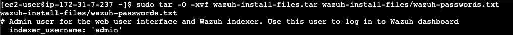

**Wazuh Dashboard web interface:**  _https://<wazuh_dashboard_ip>:443_ 
**User:**  _admin_ 
**Password:**  _\<randomly_generated_password\>_

Before you try to access it, you’ll need to allow the EC2 instance to accept HTTPS traffic. 
But first, get your host machine's public IP address by googling `What is my IP?`

WAZUH-security-group  ->  Inbound rules  ->  Edit inbound rules 
**Type:**  _HTTPS_ 
**Source:**  _<your_ip>_ 
**Description:**  _For Wazuh Dashboard_

You can now access Wazuh Dashboard from your host machine’s browser. 
Use the login credentials shown from the  `wazuh-passwords.txt`  file.

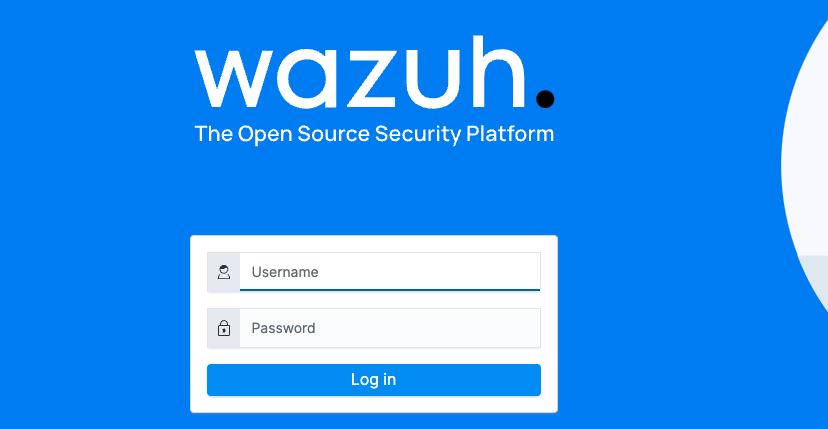

Congrats! You’ve just accessed the Wazuh Dashboard being hosted on your EC2 instance.

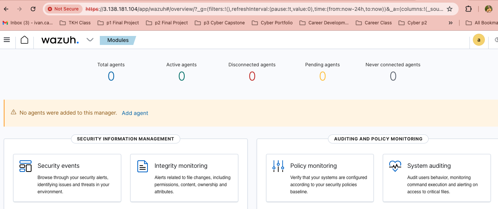

You can now begin deploying agents.

If your configurations are correc† for both instances, and there are no security settings blocking the needed ports, the Wazuh Manager will automatically pick up the Wazuh Agent!

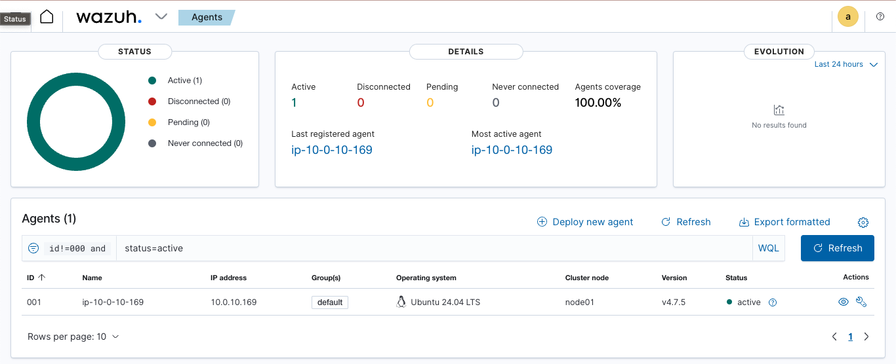

## Configuration files
Access the Wazuh configuration file at: 
`$  sudo nano /var/ossec/etc/ossec.conf`

Access the Filebeat configuration file at: 
`$  sudo nano /etc/filebeat/filebeat.yml`

Access the Wazuh passwords file at: 
`$  sudo tar -O -xvf wazuh-install-files.tar wazuh-install-files/wazuh-passwords.txt`

