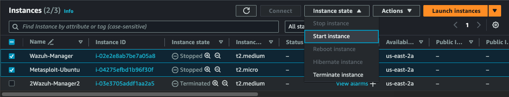
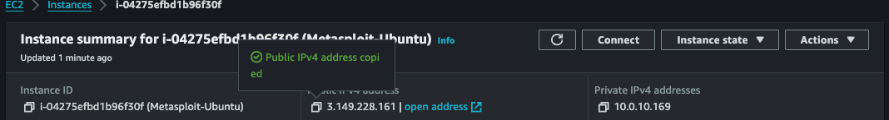
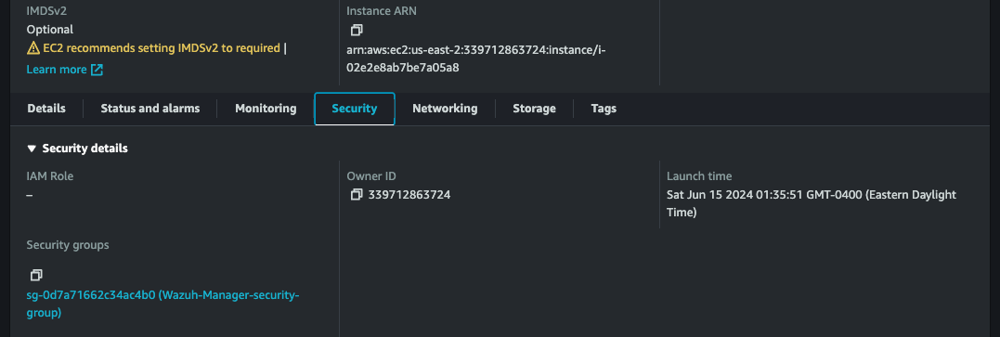
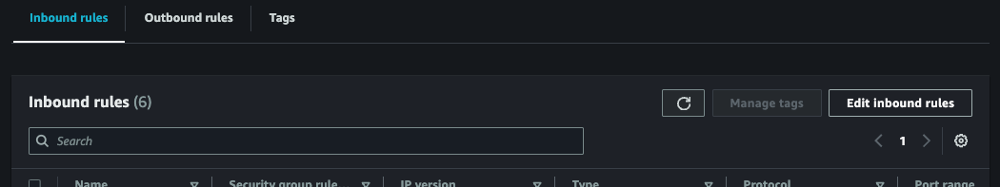
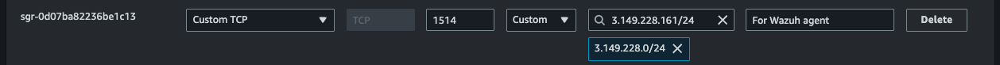
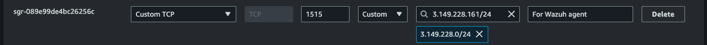
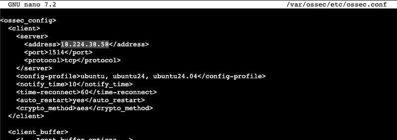
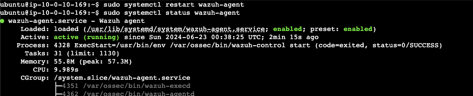

# Connecting Wazuh Agent to Manager upon turning on instances

**Start instances** 
1. Navigate to EC2 Dashboard. 
2. Check the box for Wazuh-Manager and Metasploit-Ubuntu instances.
3. Click the `Start instance` button. 

**Update Wazuh Manager firewall rules** 
Each instance will now have a new public IP address which your firewalls will be blocking. Update the rules.

1. Navigate to the Metasploit-Ubuntu EC2 instance page. 
2. Copy the `Public IPv4 address` to your clipboard.

3. Navigate to Wazuh-Manager EC2 instance page.
4. Click on the `Security` tab.
5. Click on the `Wazuh-Manager-security-group` link.

6. Click on the `Edit inbound rules` button.

7. Paste the Metasploit-Ubuntu public IP address into the `1514` and `1515` rules. Remember that it needs the subnet’s CIDR.

 

8. Click the `Save rules` button.

**Update Wazuh Agent firewall rules** 
Follow a similar protocol for the agent's firewall rules.

1. Navigate to the Wazuh-Manager EC2 instance page. 
2. Copy the `Public IPv4 address` to your clipboard.

3. Navigate to Metasploit-Ubuntu EC2 instance page.
4. Click on the `Security` tab.
5. Click on the `Metasploit-Ubuntu-security-group` link.
6. Click on the `Edit inbound rules` button.
7. Paste the Wazuh-Manager public IP address into the `1514` and `1515` rules. Remember that it needs the subnet’s CIDR.

8. Click the `Save rules` button.

**Update Wazuh Agent configuration file** 
This file can be accessed with the following command: 
`sudo nano /var/ossec/etc/ossec.conf`

Find the nested `<client> -> <server> -> <address>` tag near the top of the file. 
Paste the Wazuh manager's _public IP_ (instead of private IP) within the `<address>` tag, with no quotes.

Finally, restart the wazuh-agent daemon: 
`sudo systemctl restart wazuh-agent`

Check the service's status to make sure it's has started running recently (since restart):
`sudo systemctl status wazuh-agent`

# Resizing EC2 instance volume
I recommend that you intermittently check the available space in your instance before the storage completely runs out of space. You can view available storage with the following command: 
`df -h`

In the event that you'll need to extend storage space, the instructions can be found here: 
[EBS](EBS.md#modify-volume)

It is recommended that you first back up your instance with the following instructions: 
[EBS](EBS.md#create-volume-snapshot)

